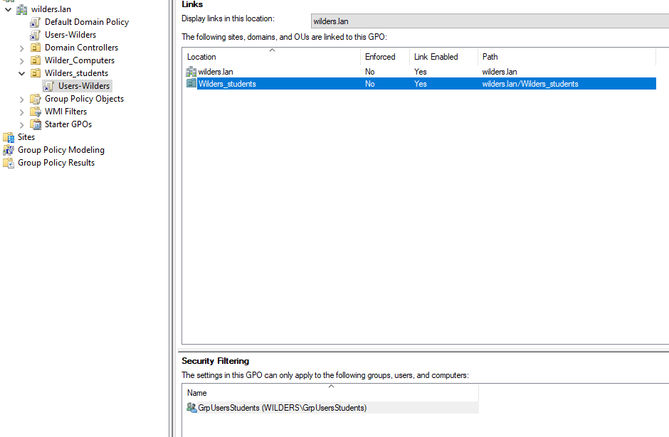
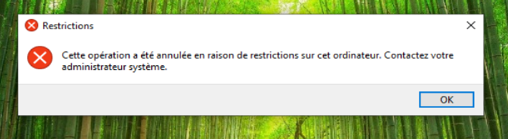

## Quêtes Active Directory Domain Services - Les Stratégies de Groupes ou GPO
- La GPO Users-Wilders est appliquée à l’OU Wilders_students avec un filtrage sur le groupe GrpUsersStudents.

---
- Sur le poste client, l’accès au panneau de configuration est bloqué par la GPO Users-Wilders.

